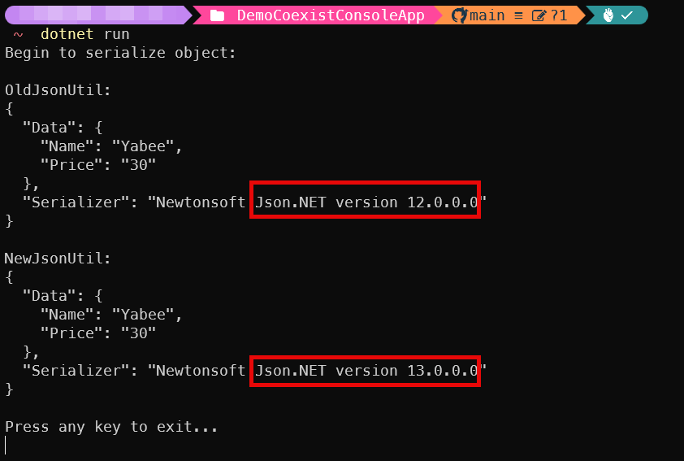

# Multiple version of the same Assembly file demo

This is a demo of how to use multiple versions of the same Assembly file in a single project, like the following screen shot that shows using JSON.NET v12 & v13 at one single console application project.

## How to run this demo

1. Build demo nuget packages: run the `build_libs.ps1` script in the **libs** folder in this repo.
2. On the **DemoCoexistConsoleApp** folder in the repo, run the `dotnet run` command to invoke the demo console application.